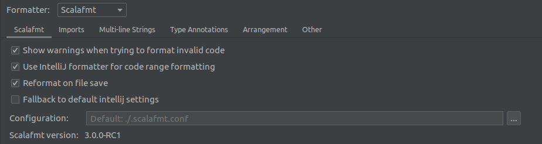

[](https://github.com/fedor-malyshkin/coding-scala/actions/workflows/ci.yml)

# coding-scala

Some exercise in Scala

## Requirements

* Scala 2.13

## Platforms/Courses

* [hackerrank.com](http://hackerrank.com)
* [Udemy](http://udemy.com)
    * [Scala Advanced, Part 1 - The Scala Type System](https://www.udemy.com/course/scala-advanced-part-1-the-scala-type-system)
    * [Scala Advanced, Part 2 - Best Practices, Async, Serializing](https://www.udemy.com/course/scala-advanced-part-2)
    * [Scala Advanced, Part 3 - Functional Programming, Performance](https://www.udemy.com/course/scala-advanced-part-3-functional-programming-performance)
    * [Akka Persistence with Scala | Rock the JVM](https://www.udemy.com/course/akka-persistence)
    * [Akka Streams with Scala | Rock the JVM](https://www.udemy.com/course/akka-streams)
    * [Akka HTTP with Scala | Rock the JVM](https://www.udemy.com/course/akka-http)
    * [Akka Remoting and Clustering with Scala | Rock the JVM](https://www.udemy.com/course/akka-remoting-clustering/)

## References / Articles

* [Articles](docs/articles.md)
* [Videos](docs/videos.md)

## Run tests

```sh
./gradlew test
```

## Code formatting

I use `scalafmt` (IDE settings + gradle's plugin to start it)

#### Good references worth to check
* [Twitter’s Effective Scala](http://twitter.github.io/effectivescala/) <-- more Scal'ish
* [Databricks Scala Guide](https://github.com/databricks/scala-style-guide) <-- less Scal'ish
* [The Official Scala Style Guide](http://docs.scala-lang.org/style)

I use such settings:


since it looks like IntelJ too often use its own formatter instead `scalafmt` to optimise performance that could easily cause different results.
